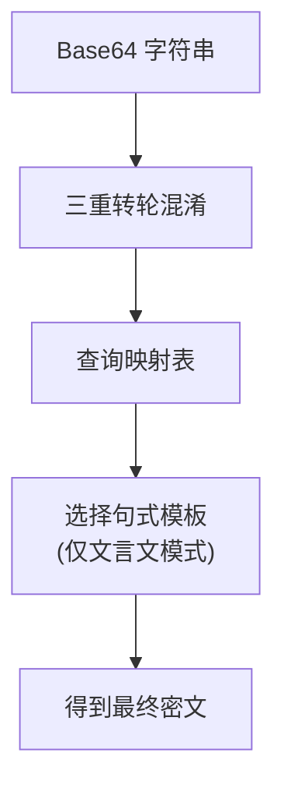

# 字符映射管线

字符映射管线有三个主要部分：

- **词性字符映射表** - 根据语法功能将 Base64 字符映射到中文字符
- **虚词映射表** - 提供文言文虚词和助词的选取
- **句式模板** - 定义用于生成连贯句子的语法结构

魔曰的密本不同于任何同类型的工具，它由数百个《通用规范汉字表》中的一级字和二级字构成，也有一些非常常见的 **日本和制汉字(Kanji)**，比如 **桜(Sakura)**；没有任何让人眼花缭乱的诡异汉字。

字符映射表是纯人工挑选编纂的，且公开可查，查阅 [**映射表(传统)**](https://github.com/SheepChef/Abracadabra/blob/main/src/javascript/mapping.json) 或者 [**映射表(仿真)**](https://github.com/SheepChef/Abracadabra/blob/main/src/javascript/mapping_next.json) 以了解密本的全貌。

古文句式模板编纂时参考了《古文观止》和《古文辞类纂》，资料来自 [**中国哲学书电子化计划**](http://ctext.org/zhs)。

## 传统密表

::: tip 传统模式示例
困句夏之全玚凪斋或骏琅咨兆咩谜理金说宙银歌舒
:::

传统模式的密表是几百个常见汉字，加密结果为这些汉字组成的无序字符串。

在传统模式下，会在随机位置对密文添加标志位，用来简化加解密操作流程，程序识别到加密标志位便会自动解密，无需用户手动指定解密，提高便利性。你也可以生成没有标志位的密文，此时需要手动指定强制解密。

传统模式类似此前存在过的诸多加密项目，加密效率高，密文较短，随机性很强，适用于一般场景。

## 文言句式模板和密表

句式模板有一个固定的语法，以辅助解析。

```
8D/N/anti/MV/V/N/，/still/继/N/V/，/why/，/and/N/而/anti/V/N/ye/P

// 8 -> 载荷数量
// "/" ->语素分隔符
// N->名词 V->动词 A->形容词 AD->副词
// B->一般句式  C->骈文句式 D->逻辑句式 E->既是骈文句式，又有逻辑
// P->句号 Q->问号 R->冒号和引号 | 依需要添加在句式末尾，代替原有逗号。
// by/why/anti... -> 虚词

// 其他(汉字)原样保留
```

密表则按照词性分类，将动词，形容词，副词，和名词分开映射。

## 字符映射流程

魔曰的字符映射完全基于 Base64，每个有效汉字对应一个 Base64 字符范围内的字符。

汉字在映射时经过三重转轮混淆，确保映射关系足够复杂，进一步增加攻击抗性。


