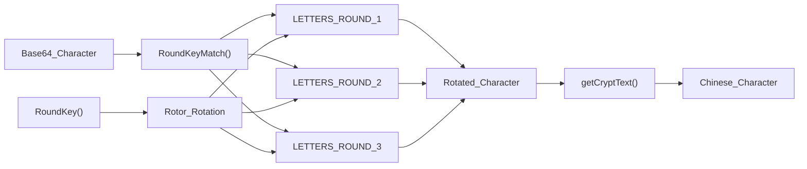
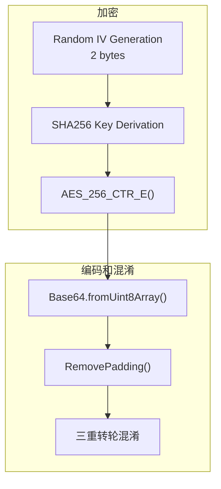

# 加密和混淆管线

魔曰使用 AES-256-CTR 作为核心加密算法。使得密文的安全性有强力保证。

## AES-256

魔曰会将用户提供的密钥，执行一次 SHA256 哈希，取其值作为密钥。

然后，对第一次哈希的结果附加两个随机字节，再次哈希，取其值作为加密的 IV。

## 三重转轮混淆

转轮混淆之前的原文，是一个使用 AES 加密后数据编码而成的 Base64 字符串，转轮混淆对其的处理为彻底打乱 Base64 字符串的字母/数字/符号，使其无法被正常解码为上一层 AES256 加密后的字节数据(包括两字节 IV 在内)。



### 密钥和操作数

1. 对密钥进行 SHA256
2. 对 SHA256 后得到的 32 字节数组中的每个元素执行对十取余，得到一个操作数数组(这个数组中每个元素的大小不超过 9，不小于 0)

### 轮转规则

混淆时，每混淆/映射一个字符，就取当前操作数，执行一次转轮轮转，并将当前操作数的索引偏移一位。

下次加密便会从操作数数组中取下一个操作数执行转轮轮转。如果取到数组末尾，则从头开始，循环往复。

轮转方向和距离由当前操作数(N)决定。  
遵守以下规则：

- 如果操作数为 0，将其当作 10 并继续

如果该操作数是偶数(N%2 == 0)

- 将第一个密钥轮向右轮 6 位
- 将第二个密钥轮向左轮 N\*2 位
- 将第三个密钥轮向右轮(N/2)+1 位

如果该操作数是奇数(N%2 != 0)

- 将第一个密钥轮向左轮 3 位
- 将第二个密钥轮向右轮 N 位
- 将第三个密钥轮向左轮(N+7)/2 位

其中，第一个和第三个转轮为顺序轮，第二个转轮为乱序(手动打乱)轮。

转轮每次转动方向和距离由操作数组(密钥)决定
可能的密钥空间为 10^32。

### 映射规则

映射采用 字母 -> 索引 -> 字母 -> 索引 的重复操作。

设立一个原映射标准字符串(实际比这个要长得多)

```
abcdefjhigk....
```

三个转轮的长度和原字符串一致。
假设三个转轮状态如下。
(下一个字符加密时会轮转)

```
bcdefjhigka....
edfbjichgak....
fjhigkabcde....
```

现在，假设我们要混淆字符 a

1. 在原字符串中找到字符 a 的索引，得到 0
2. 在第一个转轮中查找索引 0，得到字符 b
3. 在原字符串中查找字符 b 的索引，得到 1
4. 在第二个转轮中查找索引 1，得到字符 d
5. 在原字符串中查找字符 d 的索引，得到 3
6. 在第三个转轮中查找索引 3，得到字符 i

由此完成了 a --> i 的转轮映射。

其他所有字符以此类推，均可得到一个映射。  
(这个映射可以和原文本相同，修正了 Enigma 机的弱点)

每轮转一次转轮，都会得到一个完全不同的映射表，轮转规则见上一小节。

## 加密总流程

<br>


