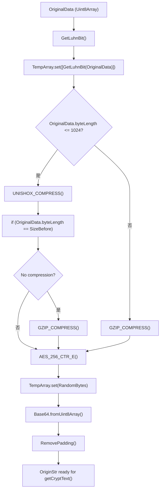
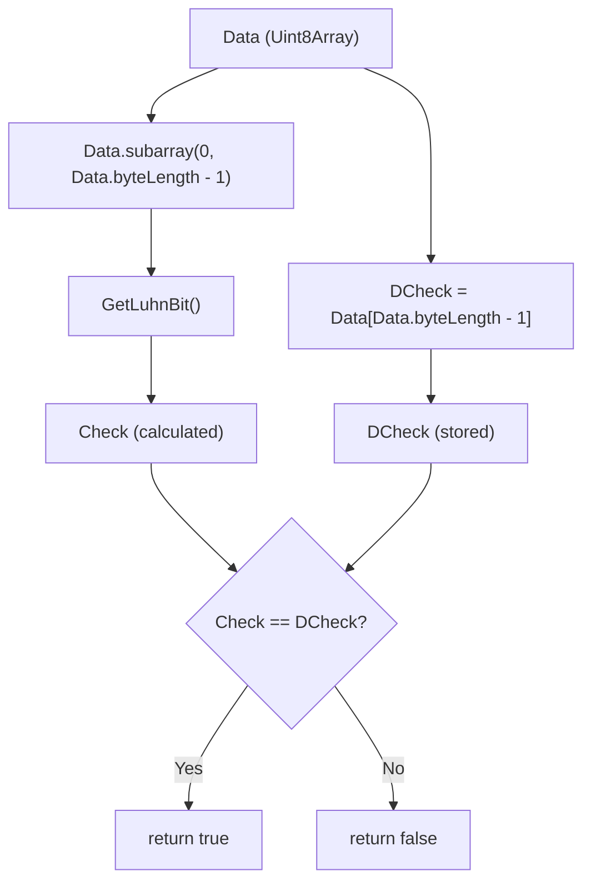

# 压缩和校验管线

## 压缩管线

魔曰使用多阶压缩管线，在加密之前对输入数据执行压缩。通过自适应算法选择和智能内容检测来选择合适的压缩策略。

针对短文本，本项目使用针对短文本优化的 [**Unishox2**](https://github.com/siara-cc/Unishox2) 压缩算法，避免了通用压缩算法(如 GZIP 等)文件头过重的问题。一般数据(>1KB)则采用 GZIP。

针对链接和常见域名编排了字典，有效提高特定链接(例如网盘链接)的压缩效率。

压缩后会执行效率验证，如果出现无效压缩，则自动回落到原始数据。

### 压缩总流程

 

### URL 针对性优化

魔曰对一些协议头，域名和 TLD 执行了特殊优化。编排了一个自定义字典。

| 字典分配 | 标识符 | 域名和关键字                     |
| -------- | ------ | -------------------------------- |
| 国内网盘 | 254    | `lanzou`, `pan.quark.cn` ...     |
| 国际网盘 | 245    | `mypikpak.com`, `mega.nz`...     |
| 国内网站 | 253    | `baidu.com`, `b23.tv`...         |
| 国际网站 | 252    | `google.com`, `youtube.com`...   |
| 国际网站 | 244    | `wikipedia.org`, `github.com`... |
| 日本网站 | 251    | `pixiv.net`, `nicovideo.jp`...   |
| 资源网站 | 250    | ————                             |

## 校验管线

项目使用轻量化的 [**卢恩算法**](https://zh.wikipedia.org/zh-cn/%E5%8D%A2%E6%81%A9%E7%AE%97%E6%B3%95)(US2950048， ISO/IEC 7812-1) 来对解密结果做简单校验，能够检出 70%的错误。

卢恩算法比起 Hmac 和 AES-GCM，安全性稍弱，但它十分轻量，校验位仅占一个字节。

### 校验总流程

 

