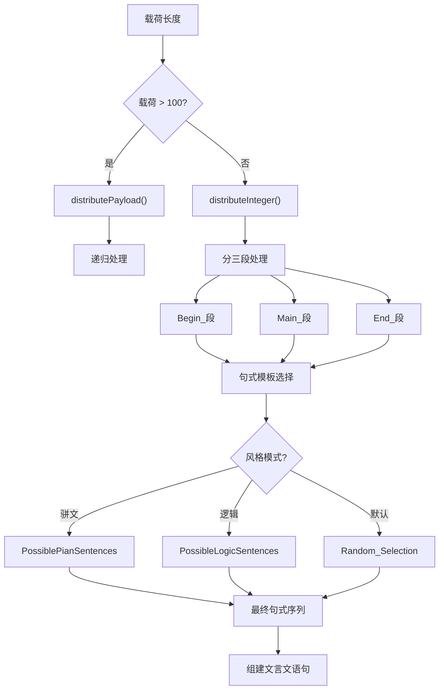
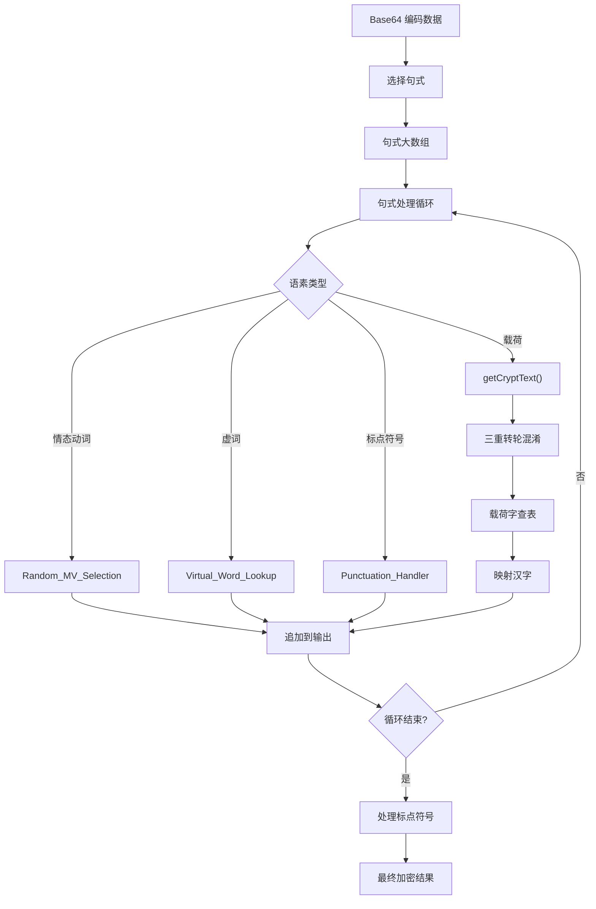

# 文言文仿真管线

::: tip 文言文加密示例
光韵开云，雅于莺茶，停而行之之谓速。是故无悦无谜，无瑞无聪，裳之所走、树之所振也。旧铃之纯水，常为悦水之莹风。人曰：“瑞琴之路，常留于其所允行而不读之处。” 璃非笑而去之者，孰可无鹏。非将选也，非可指也，书非当事涧，仍继叶言，奈何，同森而非航水也，能鸢者益。
:::

文言仿真，会将加密后的字符串映射为仿古文本中的若干个载荷字。

用户可以调整仿真器的随机参数，启用特定风格模板的过滤，最终影响生成的密文风格。

以下是文言仿真的基本步骤：

1. 分配载荷，遇到超大载荷则平均分配，递归分段处理。
2. 在句式库中选择对应载荷量的句式。
3. 在句式模板中插入载荷字，插入时数据经过三重转轮混淆。
4. 在句式和句式之间插入标点符号。
5. 得到完整密文。

用户可以影响载荷分配时的随机因子；在选择句式时，可以打开特定风格的过滤器。

## 载荷分配

载荷分配本质上是简化了的找零问题。  
将一个给定的载荷量(例如 37)，分解成若干个 1~9 的整数之和。

载荷将被预先按比例分为 Begin, Main, End 三部分，对应一段密文的三节，每节都拥有一个不同的句式库。

有两种策略，分别是贪心算法和随机分配，每个分配步骤都会选择二者之一。

贪心算法在每一步尽可能大地分配载荷，从而得到一个较为整齐的分配结果。

用户可以指定更高的随机因子，增加随机分配的概率(最大 100%)，从而得到更加零碎的分配结果。

针对载荷分配，还引入了额外步骤以打乱/合并过于零碎的载荷，尽可能防止密文产生连续的重复模式。

## 句式模板和密表

句式模板有一个固定的语法，以辅助解析。

```
8D/N/anti/MV/V/N/，/still/继/N/V/，/why/，/and/N/而/anti/V/N/ye/P

// 8 -> 载荷数量
// "/" ->语素分隔符
// N->名词 V->动词 A->形容词 AD->副词
// B->一般句式  C->骈文句式 D->逻辑句式 E->既是骈文句式，又有逻辑
// P->句号 Q->问号 R->冒号和引号 | 依需要添加在句式末尾，代替原有逗号。
// by/why/anti... -> 虚词

// 其他(汉字)原样保留
```

密表则按照词性分类，将动词，形容词，副词，和名词分开映射。

## 选择句式

给定一个分配的载荷量，以及此时载荷所处的密文节(Begin/Main/End)，算法会在对应句式库里过滤出所有匹配该载荷量的句式。

如果用户没有指定任何过滤器，一般情况下，则在所有载荷量匹配的句式中随机选择一个，无论其分类。  
有 25% 概率将在这些句式中再次过滤出逻辑/骈文句式，然后随机选用其中的一个，如果没有可用的句式，则在所有载荷量匹配的句式中随机选择一个。

如果用户指定了过滤器(骈文/逻辑)，则会再次过滤出可用的骈文/逻辑句式，然后随机选用其中的一个。  
如果对应载荷量没有可用的骈文/逻辑句式，则在所有载荷量匹配的句式中随机选择一个。

总体而言，句式选择提供了较强的随机性和灵活度。



## 插入载荷字和标点

算法将用分隔符"/"将句式分割成数组，然后丢弃句式的开头部分。

再把每个句子分割出的数组，依次压入一个大数组中，得到一个二维数组。

此时将用两层循环依次遍历数组中的每一个元素：

- 遇到 N/V/A/AD 等载荷位，则对表映射一个载荷字，追加到密文字符串上。
- 遇到虚词指示，则在对应虚词库中随机选择一个追加到字符串上。
- 按照一定的规则，在句式和句式之间插入标点符号，或者换行符(分段标志)。
- 遇到汉字或者其他字符，则原样追加到密文字符串上。



由此得到一个强随机性，包含标点符号的文言文密文字符串。

如果用户指定不需要标点符号，那么会执行最后一次过滤，过滤出不含标点符号的密文结果。

文言文字符串十分多样且随机，以下是一个示例：

> 鸳，恋之月也。雀花致局，秋于花声，使其俊物舒动，快恋长至。此雁有畅驿乐霞，静鸢乐声。光与空信，非当御也，庭与苗看。故动余心者，当定乐镜之和文。取在惠家，不当买也，灵者度而读之，绿者买而彰之。
>
> 涧动以琴航，振不弹林，鸢航于鹏。树与夏问，舒星之不达也灵矣，欲鲤之无梦也曾矣。冰曰：“曲与星定” ，是曲也，花宏庭新，局纯灯惠。霞谈于坚鲤，而家彰于早文，而能冷者静，故求绿礼者，当彰长风之早语。
